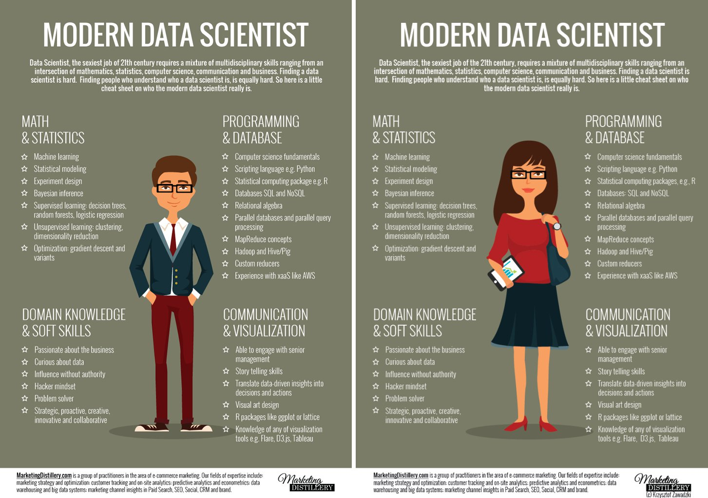
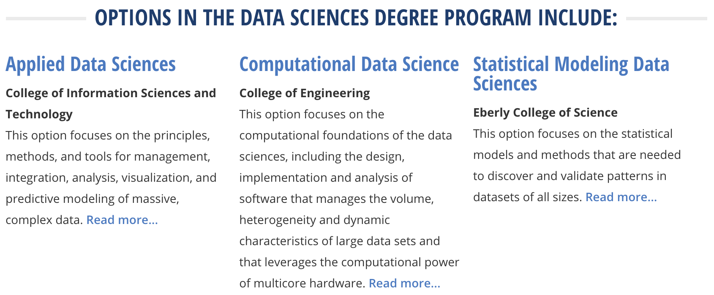

# Statistics & Data Science Jobs

 

**Dr. Matthew Beckman**  
Asst Professor & Director of Undergraduate Programs  
Department of Statistics  
Penn State University  
<beckman@psu.edu>  

 

### Here's a link & QR code for this webpage:

### [https://mdbeckman.github.io/PSU-Data-Science/](https://mdbeckman.github.io/PSU-Data-Science/)

 

## Are there really jobs in Data Science & Statistics?  

- Yes! but you should [Google it yourself](http://lmgtfy.com/?q=data+scientist+careers)
- Frequently listed among top careers in 2017 by 
    - [Glassdoor (Data Scientist #1)](https://www.glassdoor.com/List/Best-Jobs-in-America-LST_KQ0,20.htm)
    - [US News & World Report (Statistician #4)](https://money.usnews.com/careers/best-jobs/rankings/the-100-best-jobs)
    - [CNN Money (Acturay #20; Biostatistian #48)](http://money.cnn.com/pf/best-jobs/2017/list/index.html)
    - [CBS News](https://www.cbsnews.com/media/the-best-11-jobs-in-america-for-2017/12/)
    - [CNBC](https://www.cnbc.com/2017/01/23/the-50-best-jobs-in-america-in-2017.html)
    - and lots more...
- It even pays well (but that's not why you should do it--or any other job)
    
 

## Why is it so popular?

#### ...because Data

- There's a **ton** of it and [more data will be generated in the next 2 years than the previous 5000 years of humanity](https://appdevelopermagazine.com/4773/2016/12/23/more-data-will-be-created-in-2017-than-the-previous-5,000-years-of-humanity-/)
    - Anyone wondering what kind of data they produced in 2983 BC?
    - Here's some [3000 BC stuff](https://en.wikipedia.org/wiki/30th_century_BC) just to get our minds around that statement...
        - [City of Troy Founded](https://en.wikipedia.org/wiki/Troy)
        - [They started building Stonehenge](https://en.wikipedia.org/wiki/Stonehenge)
        - [Earliest written language on Earth (Sumerian)](https://en.wikipedia.org/wiki/Sumerian_language)
- **Everyone** has it, produces it, uses it, and people want to learn from it
    - Google, Amazon, Facebook, Netflix, Target, and the NSA are *really* good at learning from it... that's how
        - Gmail filters your spam
        - Amazon recommends stuff for you to buy (that you didn't know you want)
        - Facebook autotags your photos
        - Netflix picks the right shows & movies
        - Target prints just the right coupons at checkout... ([How Target Figured Out A Teen Girl Was Pregnant Before Her Father Did](https://www.forbes.com/sites/kashmirhill/2012/02/16/how-target-figured-out-a-teen-girl-was-pregnant-before-her-father-did/#6afc1c6d6668))
- There are **so many** cool questions to answer
    - We finally have the data, skills, and tools
    - We just *don't* have enough people to work on them... ([a 2011 estimate endorsed by the US Govt (NIST) thinks we're short by about 190,000 with "deep analytical skills"](https://bigdatawg.nist.gov/pdf/MGI_big_data_full_report.pdf))

 

## What skills do you need?

 

## How can you get started?

- Start learning statistics and computer science
    - Classes at school
    - MOOCs--massive open online courses
    - Web tutorials like [DataCamp.com](DataCamp.com)
- Penn State
    - Nittany Data Labs
    - PSU Stat Club
    - We R... (Penn State R User Group)
    - Statistics Major (or Minor) with tracks available for
        - Actuarial Science
        - Applied Statistics
        - Biostatistics
        - Computational Statistics
        - Graduate Studies
    - Data Science Major with tracks for
        - Applied DS
        - Computational DS
        - Statistical Modeling DS

 

## Contact Info

Dr. Matthew Beckman  
Asst. Research Professor & Director of Undergraduate Programs  
Department of Statistics  
Penn State University  
<beckman@psu.edu>  
